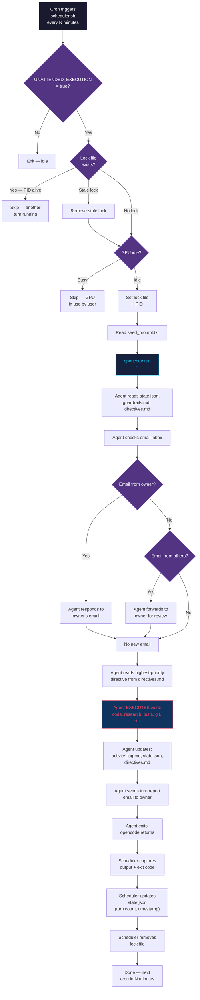

# Agent Opencode Loop — Unattended Agentic Execution with Opencode

[](LICENSE)
[](https://opencode.ai)

An unattended execution loop that turns [opencode](https://opencode.ai) into a fully autonomous agentic agent, similar in concept to OpenClaw, Cline Task Queue, or ACP-based systems — but built entirely from a shell scheduler, a JSON state file, and opencode's `run` subcommand.

## The Core Claim

**Opencode is fully viable for automated agentic loops.** A single experimental run produced 20+ autonomous turns over ~12 hours, executing 24 distinct tasks including code generation, ML model training, GitHub pushes, email correspondence, and strategic research — all without human intervention between turns.

### Verified Workflows (Experimental Run)

During a single June 2026 experimental session, the agent autonomously:

| # | Workflow | Complexity |
|---|---|---|
| 1 | Built an end-to-end ML pipeline with FastAPI serving and Prometheus metrics, pushed to GitHub | Multi-file, tests, CI-ready |
| 2 | Built a LangGraph multi-agent workflow (code review, testing, documentation agents), pushed to GitHub | Multi-file, architecture design |
| 3 | Built an OpenShift cluster health monitor with 4 checkers, LLM-based analysis, deployment manifests, pushed to GitHub | Full-stack, K8s manifests |
| 4 | Installed Python packages (`yfinance`, `lightgbm`, `torch`, `matplotlib`), built a 5-phase stock market prediction system with data pipeline, feature engineering (55 indicators), model training (LightGBM + LSTM + Regime Classifier), ensemble, and walk-forward backtesting | ML pipeline, 100+ files, 200+ tests |
| 5 | Pivoted strategy mid-execution based on backtest results (ML ensemble underperformed, built mean-reversion, then dual momentum strategies) | Strategic reasoning, self-correction |
| 6 | Researched Vast.ai GPU hosting economics, analyzed revenue vs. local-inference tradeoffs | External research, decision analysis |
| 7 | Built a PPO reinforcement learning training stack (Gymnasium env, Actor-Critic network, training loop with TensorBoard) for a card game AI | RL framework, 30 tests |
| 8 | Built a context-budget tracking tool with 43 tests and CLI | Self-improvement tooling |
| 9 | Built an intelligent model router with circuit breakers, routing across local/cloud providers, 30 tests | Infrastructure |
| 10 | Handled email correspondence: responded to human messages, forwarded third-party emails, fixed its own email tool bugs | Communication + self-repair |
| 11 | Created 35 flashcards and 10 practice scenarios for an OpenShift certification study guide | Content generation |
| 12 | Implemented response deduplication to prevent double-replying to the same email thread | Self-correction |

**The agent read its own state, checked email, chose tasks, executed, logged results, updated its state, and repeated — all orchestrated by a 210-line shell script calling `opencode run`.**

## Architecture

```
┌─────────────────────────────────────────────────────────────────────────┐
│                         CRON TRIGGER (every N min)                      │
└───────────────────────┬─────────────────────────────────────────────────┘
                        │
                        ▼
┌─────────────────────────────────────────────────────────────────────────┐
│                         SCHEDULER (scheduler.sh)                         │
│                                                                          │
│   ┌──────────────────┐    ┌──────────────────┐    ┌─────────────────┐   │
│   │ 1. Check On/Off  │───▶│ 2. Check Lock    │───▶│ 3. Check GPU    │   │
│   │    (env var)     │    │    (no overlap)  │    │    (resource    │   │
│   └──────────────────┘    └──────────────────┘    │     idle?)      │   │
│                                                    └────────┬────────┘   │
│                                                             │ pass       │
│                                                             ▼            │
│                                                    ┌─────────────────┐   │
│                                                    │ 4. Set Lock +   │   │
│                                                    │    Acquire PID  │   │
│                                                    └────────┬────────┘   │
│                                                             │            │
│                                                             ▼            │
│                                                    ┌─────────────────┐   │
│                                                    │ 5. Read Seed    │   │
│                                                    │    Prompt File  │   │
│                                                    └────────┬────────┘   │
│                                                             │            │
│                                                             ▼            │
└─────────────────────────────────────────────────────────────┼────────────┘
                                                              │
                                          ┌───────────────────┼────────┐
                                          │                   │        │
                                          ▼                   ▼        ▼
                                   ┌──────────────┐  ┌──────────────┐  ┌──────────────┐
                                   │ opencode run │  │  (AI agent   │  │  writes to   │
                                   │  "<prompt>"  │▶▶│   executes   │▶▶│   workspace: │
                                   │              │  │   via its    │  │   - code     │
                                   │  <-- blocks  │  │   tool use:  │  │   - state    │
                                   │  until done  │  │   - file I/O │  │   - logs     │
                                   │              │  │   - bash     │  │   - email    │
                                   │              │  │   - web      │  │   - git      │
                                   │              │  │   - tests    │  │   - ...      │
                                   └──────────────┘  └──────────────┘  └──────────────┘
                                                              │
                                                              ▼
┌─────────────────────────────────────────────────────────────────────────┐
│                         POST-TURN (scheduler.sh)                         │
│                                                                          │
│   ┌──────────────────┐    ┌──────────────────┐    ┌─────────────────┐   │
│   │ 6. Capture &     │───▶│ 7. Update        │───▶│ 8. Release Lock │   │
│   │    Log Output    │    │    State (JSON)  │    │    (next turn   │   │
│   └──────────────────┘    └──────────────────┘    │     eligible)   │   │
│                                                    └─────────────────┘   │
└─────────────────────────────────────────────────────────────────────────┘
```

## How It Works (Mermaid Flow)



## File Structure

```
unattended/
|-- UNATTENDED.env          # Master on/off switch (single line: true or false)
|-- scheduler.sh            # Cron-compatible scheduler with gating logic
|-- turn_runner.py          # Turn state management, reporting, status CLI
|-- seed_prompt.txt         # System prompt injected into every turn
|-- state.json              # Persistent execution state (turns, progress, emails)
|-- directives.md           # Task list: active directives + completed archive
|-- activity_log.md         # Timestamped log of every action taken
|-- approval_queue.md       # Actions needing human approval before proceeding
|-- guardrails.md           # Safety rules: what the agent must and must not do
|-- response_dedup.py       # Prevents duplicate responses to same email thread
|-- templates/
|   |-- daily_report.html   # HTML template for periodic status reports
|-- logs/
|   |-- scheduler.log       # Append-only scheduler execution log
|   |-- research/           # Research outputs from agent turns
```

## Key Components

### 1. `scheduler.sh` — The Orchestrator

A ~210-line Bash script invoked by cron. Each invocation:

1. **On/Off Gate:** Reads `UNATTENDED.env`. If `false`, exits immediately.
2. **Lock Gate:** Checks for a PID lock file. If another turn's process is alive, skips. Stale locks are cleaned up.
3. **Resource Gate:** SSHes to the inference server and checks GPU utilization via `nvidia-smi`. If any GPU exceeds a threshold (default 20%), skips. This prevents the agent from stealing GPU time from the human user's interactive sessions.
4. **Acquire Lock:** Writes its own PID to the lock file. Registers an `EXIT` trap to clean up.
5. **Execute Turn:** Reads `seed_prompt.txt`, passes it to `opencode run`. Blocks until the agent finishes.
6. **Post-Turn:** Captures output, logs it, updates `state.json` turn count and timestamp, releases lock.

**The agent has no time cap.** If a turn takes 30 minutes, it runs. The next cron invocation will see the lock and skip. The turn after that proceeds normally.

### 2. `seed_prompt.txt` — The Turn Instructions

A plain-text file containing the instructions the agent receives every turn. It tells the agent to:

1. Read `state.json` to restore context
2. Read `guardrails.md` for safety rules
3. Check email inbox (owner's emails have absolute priority)
4. Read `directives.md` for the current task queue
5. Execute meaningful work on the highest-priority directive
6. Update logs, state, and directives
7. Send a turn report email

**This is the only bridge between the scheduler and the agent's behavior.** Everything the agent does is guided by this prompt + the files it reads at runtime.

### 3. `state.json` — Persistent Memory

A JSON file the agent reads at the start of every turn and writes at the end. It tracks:
- Total turns, timestamps
- Active directive and progress summary
- Emails sent and responded threads
- Inference usage estimates
- Blockers and notes

### 4. `directives.md` — The Task Queue

A Markdown checklist. Active tasks at the top, completed tasks move down with completion dates and summaries. The agent always works on the first unchecked item.

### 5. `guardrails.md` — Safety Constraints

Non-negotiable rules the agent must follow. Absolute prohibitions (no financial transactions, no secrets exposure, no impersonation, no destructive operations outside approved directories). Approved actions and actions requiring approval.

### 6. `approval_queue.md` — Human-in-the-Loop

When the agent wants to do something outside guardrails, it documents the request here with rationale, risk assessment, and recommendation. The human reviews and approves before the agent proceeds.

## The opencode Integration

The entire agentic loop boils down to this single command in `scheduler.sh`:

```bash
opencode run "$prompt"
```

Opencode's `run` subcommand takes a message string, loads the full project context (AGENTS.md, workspace files, tools), and gives the LLM agent access to file read/write, bash execution, glob, grep, and web tools. The agent uses these tools to:

- **Read files** to restore state and context
- **Write files** to produce code, update logs, modify state
- **Run bash commands** to install packages, run tests, push to git, send emails
- **Search the codebase** to understand existing projects before modifying them
- **Fetch web content** for research

The call **blocks** until the agent completes its turn and exits. This is the critical property that makes the scheduler simple: each cron invocation is a discrete turn with a clear start and end.

### Why This Works

Opencode's architecture naturally supports this pattern because:

1. **Stateless sessions:** Each `opencode run` invocation is independent. The agent doesn't rely on a persistent server connection — it reads its state from files and writes it back.
2. **Full tool access:** The agent has file I/O, bash, search, and web access within each turn. It can do real work, not just generate text.
3. **Workspace context:** The agent loads the full project context (AGENTS.md, tool documentation, prior code) so it understands what it's working with.
4. **CLI interface:** The `run` subcommand is designed for non-interactive use — perfect for cron scripts.

## Adapting to Your Setup

This system is intentionally minimal and generic. Here's what to adapt for your environment:

### Inference Server

Our scheduler SSHes to an inference box to check GPU utilization. If you have a single machine:

- Remove the `check_gpu_utilization` function from `scheduler.sh`, or replace it with a local `nvidia-smi` check
- If you don't have GPUs, skip this gate entirely — the lock file prevents overlapping turns

### opencode Path

Our script uses a hardcoded path to the opencode binary:
```bash
OPENCODE_BIN="/home/daryl/.opencode/bin/opencode"
```
Update this to wherever opencode is installed on your system. If it's in your PATH, just use `opencode`.

### Model Provider

Our agent uses llama.cpp serving a Qwen 3.6 27B model via HTTP. Your agent can use any model provider opencode supports — Ollama, LM Studio, cloud APIs. Update your opencode config (`~/.config/opencode/opencode.jsonc`).

### Email Tooling

We use a custom Gmail automation tool. Replace with your preferred approach — sendgrid, Mailgun, simple SMTP, or just skip email and have the agent write reports to a log file or Slack webhook.

### Cron Interval

We run every 10 minutes. Adjust based on your model's speed and task complexity:
- Fast model (7B local): every 5 minutes
- Medium model (27B local): every 10-20 minutes
- Slow model (70B+ or cloud with rate limits): every 30-60 minutes

### Seed Prompt

Customize `seed_prompt.txt` for your use case. The key elements to keep:
- Read state at start, write state at end (this is the memory loop)
- Read guardrails (safety)
- Priority ordering for tasks
- Log everything (observability)

You might add:
- Slack/Discord webhook posting instead of email
- Specific tools your agent should use
- Custom output formats

## Safety

This system gives an LLM autonomous access to your filesystem and network. Take these seriously:

| Control | Purpose |
|---|---|
| `UNATTENDED.env` | Kill switch — set to `false` to stop all execution instantly |
| `guardrails.md` | Behavioral constraints — the agent reads these every turn |
| Lock file | Prevents concurrent turns from corrupting state or wasting resources |
| GPU gate | Prevents the agent from displacing the human user |
| `approval_queue.md` | Human-in-the-loop for anything beyond approved actions |
| Activity log | Full audit trail — every action is timestamped and logged |
| Cron interval | Rate limiting — the agent can't spin faster than cron allows |

**Recommendation:** Start with the loop disabled (`UNATTENDED_EXECUTION=false`). Test one turn manually with `bash scheduler.sh`. Review the output. Then enable it and watch the logs. Set the cron interval long (30+ minutes) initially.

## Costs

For a local inference setup, costs are electricity only. Our setup:

- 3 GPUs drawing ~261W during inference
- At $0.14/kWh: ~$0.04/hour, ~$1/day if running continuously
- Actual cost is lower since the agent only runs when GPUs are idle

For cloud inference, budget depends on your provider's token pricing. Track token usage in `state.json`.

## Comparison with Other Systems

| System | Approach | opencode Loop |
|---|---|---|
| OpenClaw | Custom agent framework | Uses opencode's existing CLI |
| Cline Task Queue | VS Code extension | Terminal-native, no IDE |
| ACP servers | Protocol-based, always-on server | Stateless, cron-triggered turns |
| CrewAI / LangGraph | Code framework requiring Python | Zero framework — shell + prompt |
| AutoGPT | Python agent loop | Leverages opencode's tool ecosystem |

The opencode loop's advantage is **simplicity**. It's a shell script and a prompt file. No Python framework, no custom agent loop, no message queue. The agent's intelligence comes from the LLM + opencode's tool access, not from orchestration code.

## Getting Started

1. Install [opencode](https://opencode.ai) and configure your model provider
2. Clone this repo or create the file structure in your project
3. Configure `scheduler.sh` (update paths, GPU check, cron schedule)
4. Write your `seed_prompt.txt` with turn instructions
5. Write `guardrails.md` with safety rules for your use case
6. Write `directives.md` with your first task
7. Initialize `state.json`
8. Test: `bash scheduler.sh` (with `UNATTENDED_EXECUTION=true`)
9. Review output in `logs/scheduler.log` and `activity_log.md`
10. If satisfied, add the cron entry

## License

MIT
